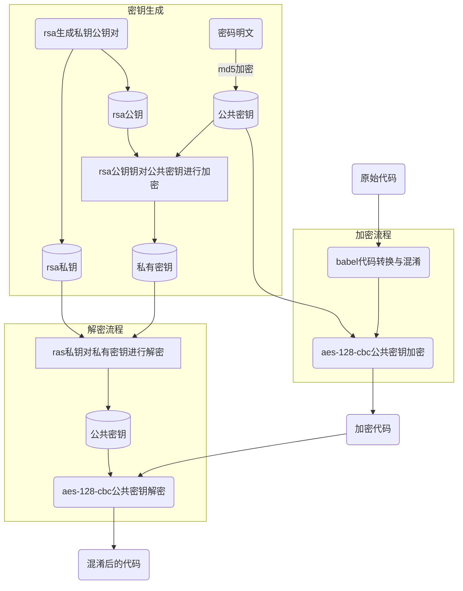

# 总体流程

该加密算法中主要分为三个模块： 
* 加解密密钥生成
* 加密过程
* 解密过程

## 加解密密钥
加解密的核心是通过16字节的`公共密钥`，利用`aes-128-cbc`加密算法进行加解密，由于`aes`算法是对称算法，所以必须用相同的`公共密钥`才能成功加解密。

另一方面，通过`rsa`算法保证加密端和解密端使用的是不同的密钥——加密段只需要`公共密钥`;解密端只有`rsa私钥`和`私有密钥`，其中`私有密钥`是通过`rsa`算法和`rsa公钥`对`公共密钥`进行加密得到的。由于`rsa`算法是非对称算法（即如果是用rsa公钥加密，必须用rsa私钥才能解密），所有解密端首先要通过`rsa`算法和rsa私钥对`私有密钥`解密得到`公共密钥`，然后利用`公共密钥`进行`aes-128-cbc`解密。

综上，密钥生成主要分为两步：
1. 生成`rsa公钥`和`私钥密钥`对（调用vscode指令:`密钥对生成`)
2. 加密`公共密钥`和`私有密钥`对生成(调用vscode指令:`加密密钥对生成`)

## 加密过程

1. 利用babel对js代码转换和混淆，降低代码的可读性
2. 利用`公共密钥`和`aes-128-cbc`将js代码加密为二进制文件
上述过程可以通过两个方法实现：
* 单个文件加密：打开一个js文件，然后右键选择`js代码加密`选项，加密完后会生成一个后缀名为`.ec`的加密二进制文件。
* 文件列表的加密：先vscode配置需要加密的文件列表`vsplatform.encryptFileList`，配置完以后调用vscode命令`代码加密`，该命令会生成一个`.ec`的加密二进制文件,并删除对应的原始js文件。

## 解密过程
解密过程主要是通过webpack 自定义loader功能对`.ec`后缀名的实现自定义加载，可以分为两步
1. 利用`私有密钥`和`rsa私钥`通过rsa算法获得`公共密钥`
2. 利用`公共密钥`对`.ec`二进制文件解密得到混淆后的代码

