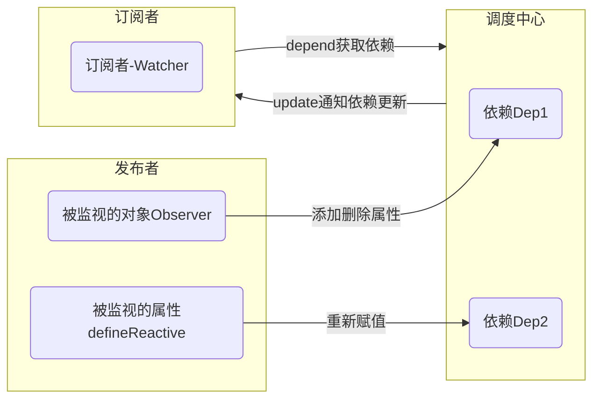

[TOC]

# vue 响应试更新学习

## 介绍

vue 的数据的双向绑定是通过[发布订阅模式](../../design_pattern/publish_subscribe.md)和数据劫持实现的，其主要实现代码在`/src/core/observer`目录下的`observer.js`(发布者 或 主题)、`dep.js`(基于依赖的调度中心)、`watcher.js`(订阅者 或 观察者)， 此外，`array.js`主要实现了被观察的数组的相关方法的劫持、`scheduler.js`用于异步 Watcher 的调度;

## 设计思路

1. 通知阶段：每个被观察的属性（`Observer`）或对象（`defineReactive`）为一个发布者，对象或属性被修改时通知依赖重新（`notify`方法），然后依赖通知对应的订阅者。
2. 依赖收集阶段：订阅者为通过一个函数去收集依赖(调用依赖的`depend`方法)。



### 发布者

Vue 有两种类型的发布者，每一个发布者与依赖(`Dep`)是一一对应的，通过`Dep`通知订阅者依赖发生了改变。两类之间观察者存在递归关系，当时通过`__ob__`属性可以防止一个对象多次绑定观察者。

- 第一种发布者

```typescript
export class Observer {
  value: any; //
  dep: Dep;
  vmCount: number; // number of vms that have this object as root $data

  constructor(value: any) {
    this.value = value;
    this.dep = new Dep();
    this.vmCount = 0;
    def(value, "__ob__", this);
    if (Array.isArray(value)) {
      if (hasProto) {
        protoAugment(value, arrayMethods);
      } else {
        copyAugment(value, arrayMethods, arrayKeys);
      }
      this.observeArray(value);
    } else {
      this.walk(value);
    }
  }

  /**
   * Walk through all properties and convert them into
   * getter/setters. This method should only be called when
   * value type is Object.
   */
  walk(obj: Object) {
    const keys = Object.keys(obj);
    for (let i = 0; i < keys.length; i++) {
      defineReactive(obj, keys[i]);
    }
  }

  /**
   * Observe a list of Array items.
   */
  observeArray(items: Array<any>) {
    for (let i = 0, l = items.length; i < l; i++) {
      observe(items[i]);
    }
  }
}
```

第一种发布者被绑定到一个对象的`__ob__`属性上，添加或删除属性时触发更新。

- 第二种发布者

```typescript
export function defineReactive(
  obj: Object,
  key: string,
  val: any,
  customSetter?: ?Function,
  shallow?: boolean
) {
  const dep = new Dep(); // 创建一个依赖

  const property = Object.getOwnPropertyDescriptor(obj, key);
  if (property && property.configurable === false) {
    return;
  }

  // cater for pre-defined getter/setters
  const getter = property && property.get;
  const setter = property && property.set;
  if ((!getter || setter) && arguments.length === 2) {
    val = obj[key];
  }

  let childOb = !shallow && observe(val); // 如果val是一个对象，则创建第一种发布者
  Object.defineProperty(obj, key, {
    enumerable: true,
    configurable: true,
    get: function reactiveGetter() {
      const value = getter ? getter.call(obj) : val;
      if (Dep.target) {
        dep.depend(); // 添加属性依赖
        if (childOb) {
          childOb.dep.depend(); // 添加子对象依赖
          if (Array.isArray(value)) {
            dependArray(value);
          }
        }
      }
      return value;
    },
    set: function reactiveSetter(newVal) {
      const value = getter ? getter.call(obj) : val;
      /* eslint-disable no-self-compare */
      if (newVal === value || (newVal !== newVal && value !== value)) {
        return;
      }
      /* eslint-enable no-self-compare */
      if (process.env.NODE_ENV !== "production" && customSetter) {
        customSetter();
      }
      // #7981: for accessor properties without setter
      if (getter && !setter) return;
      if (setter) {
        setter.call(obj, newVal);
      } else {
        val = newVal;
      }
      childOb = !shallow && observe(newVal);
      dep.notify(); // 通知依赖更新
    },
  });
}
```

第二种发布者通过属性劫持实现，在 get 方法中添加依赖，在 set 方法中通知依赖更新。触发第二类观察者更新可以通过`$set`, `$del`添加删除属性实现。

### 调度中心

Vue 中没有严格意义上的调度中心,但是可以将每一个`Dep`类视为一个调度规则，从而将所有的`Dep`整体视为一个调度中心。另一方面，由于`Dep`和发布者是一一对应的，可以将发布者和`Dep`整体视为[观察者模式](../../design_pattern/observer_pattern.md)的主题，区别是观察者可以同时观察多个主题（发布者）。`Dep`的代码如下：

```typescript
export default class Dep {
  static target: ?Watcher;
  id: number;
  subs: Array<Watcher>; // 依赖于当前依赖的观察者

  constructor() {
    this.id = uid++;
    this.subs = [];
  }

  addSub(sub: Watcher) {
    this.subs.push(sub);
  }

  removeSub(sub: Watcher) {
    remove(this.subs, sub);
  }

  depend() {
    if (Dep.target) {
      Dep.target.addDep(this); // 将观察者添加到当前依赖中，其中做了防止重复添加依赖的判断
    }
  }

  notify() {
    // 依赖更新通知
    // stabilize the subscriber list first
    const subs = this.subs.slice();
    if (process.env.NODE_ENV !== "production" && !config.async) {
      // subs aren't sorted in scheduler if not running async
      // we need to sort them now to make sure they fire in correct
      // order
      subs.sort((a, b) => a.id - b.id);
    }
    for (let i = 0, l = subs.length; i < l; i++) {
      subs[i].update();
    }
  }
}
```
Dep的`depend`方法实际上就是将当前订阅者(`Dep.target`)添加到依赖的订阅者队列里。

### 订阅者

```typescript
export default class Watcher {
  vm: Component;
  expression: string;
  cb: Function;
  id: number;
  deep: boolean;
  user: boolean;
  lazy: boolean;
  sync: boolean;
  dirty: boolean;
  active: boolean;
  deps: Array<Dep>;
  newDeps: Array<Dep>;
  depIds: SimpleSet;
  newDepIds: SimpleSet;
  before: ?Function;
  getter: Function;
  value: any;

  constructor(
    vm: Component, // vm
    expOrFn: string | Function, // 监视的函数或者表达式
    cb: Function, // 更新回调
    options?: ?Object, // 监视选项
    isRenderWatcher?: boolean // 是否是渲染函数的Wacher
  );

  /**
   * Evaluate +he getter, and re-collect dependencies.
   */
  get() {
    // 计算值，并且收集依赖
    pushTarget(this); // 当前期Watcher设置为依赖的当前目标
    let value;
    const vm = this.vm;
    try {
      value = this.getter.call(vm, vm); // 获取value的依赖
    } catch (e) {
      if (this.user) {
        handleError(e, vm, `getter for watcher "${this.expression}"`);
      } else {
        throw e;
      }
    } finally {
      // "touch" every property so they are all tracked as
      // dependencies for deep watching
      if (this.deep) {
        traverse(value); // 遍历value的所有属性和子对象和子对象的属性
      }
      popTarget(); // 回滚依赖目标
      this.cleanupDeps(); 
    }
    return value;
  }

  /**
   * Add a dependency to this directive.
   */
  addDep(dep: Dep); // 添加依赖

  /**
   * Clean up for dependency collection.
   */
  cleanupDeps(); // 储存新的依赖

  /**
   * Subscriber interface.
   * Will be called when a dependency changes.
   */
  update() {
    /* istanbul ignore else */
    if (this.lazy) { // computed的默认属性
      this.dirty = true;
    } else if (this.sync) {
      this.run();
    } else {
      queueWatcher(this); // 默认的watch，异步调用
    }
  }

  /**
   * Scheduler job interface.
   * Will be called by the scheduler.
   */
  run() {
    if (this.active) {
      const value = this.get();
      if (
        value !== this.value ||
        // Deep watchers and watchers on Object/Arrays should fire even
        // when the value is the same, because the value may
        // have mutated.
        isObject(value) ||
        this.deep
      ) {
        // set new value
        const oldValue = this.value;
        this.value = value;
        if (this.user) {
          try {
            this.cb.call(this.vm, value, oldValue);
          } catch (e) {
            handleError(
              e,
              this.vm,
              `callback for watcher "${this.expression}"`
            );
          }
        } else {
          this.cb.call(this.vm, value, oldValue);
        }
      }
    }
  }

  /**
   * Evaluate the value of the watcher.
   * This only gets called for lazy watchers.
   */
  evaluate() {
    this.value = this.get();
    this.dirty = false;
  }

  /**
   * Depend on all deps collected by this watcher.
   */
  depend(); // 重新添加当前Watcher的所有依赖到其他Watcher上

  /**
   * Remove self from all dependencies' subscriber list.
   */
  teardown(); // 从依赖中移除当前Watcher
}
```
每一个订阅者通过`evaluate`方法重新计算值，`get`方法重新计算依赖。在依赖更新以后调用`update`方法。

## Array优化
Vue会给每一个被观察的对象及其子对象的添加一个`Observer`观察者，如果被观察的对象的数据量非常大的话，会造成大量的内存消耗，在渲染图表时，大数据量的需求是比较常见的。事实上vue对`Array`的监视也进行了优化，并没有对`Array`的所有属性进行劫持，而只是劫持来了被监视的`Array` 的`push`,`pop`,`shift`, `unshift`,`splice`, `sort`， `reverse`几个方法, 在用Vue对大数据量时，尽量使用Array进行渲染。

除此之外，如果`Array`的元素是对象的话，也会对`Array`的每一个元素创建观察者，但是如果`Array`的元素只是简单的数据类型，则可以避免这种情况。所以，如果`Array`的元素是对象的话，需要把这个对象分解成多个简单数据类型的`Array`。


``` typescript
const methodsToPatch = [
  'push',
  'pop',
  'shift',
  'unshift',
  'splice',
  'sort',
  'reverse'
]

/**
 * Intercept mutating methods and emit events
 */
methodsToPatch.forEach(function (method) {
  // cache original method
  const original = arrayProto[method]
  def(arrayMethods, method, function mutator (...args) {
    const result = original.apply(this, args)
    const ob = this.__ob__
    let inserted
    switch (method) {
      case 'push':
      case 'unshift':
        inserted = args 
        break
      case 'splice':
        inserted = args.slice(2)
        break
    }
    if (inserted) ob.observeArray(inserted) // 如果有新增的元素，则对其子元素一并进行监视
    // notify change
    ob.dep.notify()
    return result
  })
})
```
<style>
.mume .node,.label {
    font-size: 13px;
}
</style>
