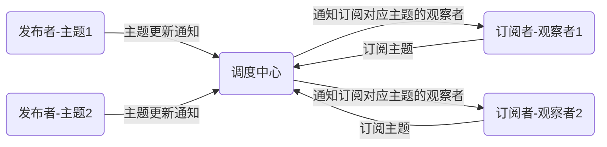

# 发布/订阅模式

发布/订阅模式与[观察者模式](./observer_pattern.md)非常相似，他解决了观察者模式中，一个观察者只能观察一个主题的问题，并且通过调度中心将发布者和订阅者完全解耦。

## 设计思路

- 注册阶段：`观察者`向`调度中心`订阅对应的`主题`，另一方面，使用者将`主题`注册到`调度中心`
- 调度阶段：`主题`发生改变时，通知`调度中心`，然后`调度中心`将主题分发到所有订阅对应主题的`观察者`



## 示例

以软件在线更新服务为例，例如有若干个组件更新服务器，在软件发布新的版本后需要通知所有包含该组件的客户端进行组件热更新，以下是用发布订阅模式的实现。

发布者-组件更新服务器

```typescript
class Publisher {
  private broker: Broker; // 调度中心
  private url: string; // 更新url
  private component: string; // 组件名称
  private version: number; // 组件版本
  constructor(broker: Broker) {
    this.broker = broker;
  }
  notify() {
    this.broker.update(this.component, this.version, this.url);
  }
}
```

调度中心-更新管理服务器

```typescript
class Broker {
  private subscribers: Set<Subscriber> = [];
  attach(subscriber: Subscriber) {
    if (!this.subscribers.has(subscriber)) {
      this.subscribers.add(subscriber);
    }
  }
  detach(subscriber: Subscriber) {
    if (this.subscribers.has(subscriber)) {
      this.subscribers.delete(subscriber);
    }
  }
  notifyAll(component: string, version: number, url: string) {
    this.subscribers
      .filter((subscriber) => {
        // 订阅更新的订阅者
        return subscriber.checkUpdate(component, version);
      })
      .forEach((subscriber) => {
        try {
          subscriber.update(component, url);
        } catch (ex) {
          console.log("更新失败");
        }
      });
  }
}
```

订阅者-客户端

```typescript
interface Component {
  version: number; // 组件版本
  name: string; // 组件名称
}
class Subscriber {
  private components: Map<Component>;
  constructor(subject: Subject) {
    this.broker = broker;
    this.subscribe();
  }
  addComponent(component: Component) {
    this.components.set(component.name, component);
  }
  checkUpdate(component: string, version: number): boolean {
    return (
      this.components.has(component) &&
      this.components.get(component).version < version
    );
  }
  update(component: string, url: string) {
    console.log(`update components from ${url}`);
    // 下载新组件
    // 卸载旧组件
    // 安装新组件
  }
  subscribe() {
    this.broker.attach(this);
  }
  unsubscribe() {
    this.broker.detach(this);
  }
}
```

## 使用情景
1. 事件通知管理
2. 软件订阅更新

<style>
.mume .node,.label {
    font-size: 13px;
}
</style>
