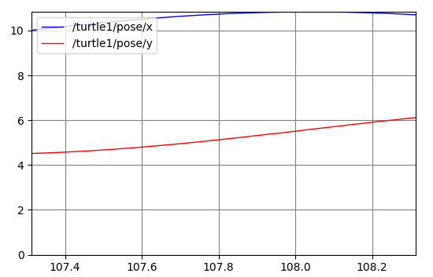

# ROS 节点（Node）的定义
ROS系统由以下几个部分组成
1. 节点（Nodes） - ROS节点是一个通过ROS与其他节点进行通信的可执行程序
2. 消息（Messages） - ROS消息是发布订阅主题所使用的结构化数据
3. 主题（Topics） - ROS节点可以发布一个消息到主题，或者订阅主题以接收消息
4. 主节点 （Master) - 主节点提供命名服务，ROS节点可以通过主节点找到其它ROS节点
5. rosout - rosout 为ROS用于的输出服务的节点，等价于 stdout/stderr
6. roscore - Master 服务、 rosout 服务以及 ros 参数服务


ROS节点就是一个通过ROS包编译出来的可执行程序，ROS节点可以通过ROS客户端库与其它节点进行通信。ROS阶段可以发布或订阅一个主题，也可以使用或者提供一个服务。

# ros节点的启动
## 启动 roscore 
在ROS启动前，首先要启动 roscore 服务，
```shell
roscore
```
如果服务正常启动，将会产生如下类似的消息
```
... logging to /home/hybtalented/.ros/log/af5e3a84-5a4a-11ec-b30a-e09467e33a05/roslaunch-hybtaletented-163-com-10904.log
Checking log directory for disk usage. This may take a while.
Press Ctrl-C to interrupt
Done checking log file disk usage. Usage is <1GB.

started roslaunch server http://hybtaletented-163-com:45577/
ros_comm version 1.14.12


SUMMARY
========

PARAMETERS
 * /rosdistro: melodic
 * /rosversion: 1.14.12

NODES

auto-starting new master
process[master]: started with pid [10929]
ROS_MASTER_URI=http://hybtaletented-163-com:11311/

setting /run_id to af5e3a84-5a4a-11ec-b30a-e09467e33a05
process[rosout-1]: started with pid
```

## ROS节点查看
首先，通过rosnode list 命令可以查看到当前正在运行的ros节点
```shell
hybtalented@hybtaletented-163-com:~$ rosnode list
/rosout
```
上诉输出表示，目前只有一个rosout节点正在运行。再次输入 rosnode info /rosout 可以查看rosout的节点信息如下

```
--------------------------------------------------------------------------------
Node [/rosout]
Publications: 
 * /rosout_agg [rosgraph_msgs/Log]

Subscriptions: 
 * /rosout [unknown type]

Services: 
 * /rosout/get_loggers
 * /rosout/set_logger_level


contacting node http://hybtaletented-163-com:41085/ ...
Pid: 10940
```
上诉消息表示 rosout 节点 发布了主题 /rosout_agg 其中消息类型为 rosgraph_msgs/Log；订阅了主题 /rosout；提供了两个服务，分别为 /rosout/get_loggers 和  /rosout/set_logger_level；可以通过 http://hybtaletented-163-com:41085/ 与节点进行通信，其进程id为 10940。


## 启动 ROS 节点
通过 `rosrun` 命令可以启动ROS节点
```shell
rosrun turtlesim turtlesim_node
```
上述命令表示启动 `turtlesim` 包中的  `turtlesim_node`节点，运行命令后将会看到一个包含一个海龟的窗口。
这是，在另一个终端输入 `rosnode list` 可以查看到节点列表如下所示
```
/rosout
/turtlesim
```
`rosrun` 可以通过重映射参数改变节点的名称如下
```shell
rosrun turtlesim turtlesim_node __name:=my_turtle
```
再次执行 `rosnode list`  可以看到节点名称已经改变。

```
/my_turtle
/rosout
/turtlesim
```
可以发现/turtlesim 节点并没有消失，这是因为本文中是通过 `Ctrl+C`强制结束节点进程，而不是通过关闭窗口的方式，这时可以通过 `rosnode cleanup`可以清理掉已经退出的节点的信息。

```shell
hybtalented@hybtaletented-163-com:~$ rosnode cleanup
ERROR: connection refused to [http://hybtaletented-163-com:42405/]
Unable to contact the following nodes:
 * /turtlesim
Warning: these might include alive and functioning nodes, e.g. in unstable networks.
Cleanup will purge all information about these nodes from the master.
Please type y or n to continue:
y
Unregistering /turtlesim
done
hybtalented@hybtaletented-163-com:~$ rosnode list
/my_turtle
/rosout
```

# ROS 主题(Topic)

## 主题与节点的关系
首先确保 roscore 和 `turtlesim_node` 节点已经启动，运行
```shell
hybtalented@hybtaletented-163-com:~$ rosnode info turtlesim
--------------------------------------------------------------------------------
Node [/turtlesim]
Publications: 
 * /rosout [rosgraph_msgs/Log]
 * /turtle1/color_sensor [turtlesim/Color]
 * /turtle1/pose [turtlesim/Pose]

Subscriptions: 
 * /turtle1/cmd_vel [geometry_msgs/Twist]

Services: 
 * /clear
 * /kill
 * /reset
 * /spawn
 * /turtle1/set_pen
 * /turtle1/teleport_absolute
 * /turtle1/teleport_relative
 * /turtlesim/get_loggers
 * /turtlesim/set_logger_level


contacting node http://hybtaletented-163-com:41827/ ...
Pid: 3217
Connections:
 * topic: /rosout
    * to: /rosout
    * direction: outbound (54253 - 192.168.2.148:58270) [27]
    * transport: TCPROS
 * topic: /turtle1/cmd_vel
    * to: /teleop_turtle (http://hybtaletented-163-com:42853/)
    * direction: inbound (59072 - hybtaletented-163-com:60765) [26]
    * transport: TCPROS

```
可以发现 `turtlesim_node` 订阅了 `/turtle1/cmd_vel` 主题，这个主题的消息用于通知 turtlesim_node 节点启动的窗口内的乌龟进行移动。现在我们启动另外一个节点 `turtle_teleop_key`
```shell
rosrun turtlesim turtle_teleop_key
```
通过查看节点信息
```shell
rosnode info /teleop_turtle
--------------------------------------------------------------------------------
Node [/teleop_turtle]
Publications: 
 * /rosout [rosgraph_msgs/Log]
 * /turtle1/cmd_vel [geometry_msgs/Twist]

Subscriptions: None

Services: 
 * /teleop_turtle/get_loggers
 * /teleop_turtle/set_logger_level


contacting node http://hybtaletented-163-com:42853/ ...
Pid: 2635
Connections:
 * topic: /rosout
    * to: /rosout
    * direction: outbound (60765 - 192.168.2.148:58988) [11]
    * transport: TCPROS
 * topic: /turtle1/cmd_vel
    * to: /turtlesim
    * direction: outbound (60765 - 192.168.2.148:59072) [12]
    * transport: TCPROS

```
可以发现这个节点发布了 `/turtle1/cmd_vel` 主题的消息，`turtle_teleop_key` 节点的主要作用是通过键盘控制乌龟的速度。在启动 `turtle_teleop_key` 节点的终端内通过左右方向键可以控制乌龟的方向，通过前后方向键可以控制乌龟的前进和后退。

ROS 节点之间可以通过 发布和订阅主题的方式进行通讯，例如上述的例子中`/teleop_turtle` 发布了键盘按键主题（`/turtle1/cmd_vel`）而
`/turtlesim` 订阅了同一主题，实现了通过按键控制乌龟的移动。

下面我们将用 `rqt_graph` 命令查看所有当前运行的节点和主题。
首先安装 `rqt_graph` 包
```shell
sudo apt-get install ros-melodic-rqt
sudo apt-get install ros-melodic-rqt-common-plugins
```
然后启动`rqt_graph`节点
```shell
rosrun rqt_graph rqt_graph
```
可以得到如下所示的主题订阅图

可以发现 `/teleop_turtle` 和 `/turtlesim` 之间通过主题`/turtle1/cmd_vel` 进行通信。

## 查看主题的消息
通过 rostopic 命令可以查看ros主题的消息。运行 `rostopic echo /turtle1/cmd_vel` 命令，并在 `turtle_teleop_key` 节点所在终端内按下方向键，可以查看到类似如下所示的消息
```shell
rostopic echo /turtle1/cmd_vel
linear: 
  x: 0.0
  y: 0.0
  z: 0.0
angular: 
  x: 0.0
  y: 0.0
  z: -2.0
---
linear: 
  x: 2.0
  y: 0.0
  z: 0.0
angular: 
  x: 0.0
  y: 0.0
  z: 0.0
---
linear: 
  x: 0.0
  y: 0.0
  z: 0.0
angular: 
  x: 0.0
  y: 0.0
  z: 2.0
---
```
这是，我们再次查看 `rqt_graph` 可以看到


通过 `rostopic list -v` 命令可以查看到所有的ros消息，通过`rostopic type /turtle1/cmd_vel` 可以查看`/turtle1/cmd_vel`消息的类型，通过`rosmsg show geometry_msgs/Twist`命令可以查看指定消息类型的数据结构，如下所示
```shell
rostopic list -v

Published topics:
 * /turtle1/color_sensor [turtlesim/Color] 1 publisher
 * /turtle1/cmd_vel [geometry_msgs/Twist] 1 publisher
 * /rosout [rosgraph_msgs/Log] 3 publishers
 * /rosout_agg [rosgraph_msgs/Log] 1 publisher
 * /turtle1/pose [turtlesim/Pose] 1 publisher

Subscribed topics:
 * /turtle1/cmd_vel [geometry_msgs/Twist] 1 subscriber
 * /rosout [rosgraph_msgs/Log] 1 subscriber
 * /statistics [rosgraph_msgs/TopicStatistics] 1 subscriber

hybtalented@hybtaletented-163-com:~/study$ rostopic type /turtle1/cmd_vel
geometry_msgs/Twist
hybtalented@hybtaletented-163-com:~/study$ rosmsg show geometry_msgs/Twist
geometry_msgs/Vector3 linear
  float64 x
  float64 y
  float64 z
geometry_msgs/Vector3 angular
  float64 x
  float64 y
  float64 z
```

## 主题的发布
通过 `rostopic pub` 命令可以发布一个指定主题的消息
```shell
rostopic pub -1 /turtle1/cmd_vel geometry_msgs/Twist -- '[2.0, 0.0, 0.0]' '[0.0, 0.0, 1.8]'
```
**上述命令中，`-1`表示只发布一次消息就退出，`/turtle1/cmd_vel` 和 `geometry_msgs/Twist`分别表示发布的主题和类型，`--`表示后面的参数不包含选项（即后面的参数中的`-` 不会被解析为一个选项），`'[2.0, 0.0, 0.0]'` 和 `'[0.0, 0.0, 1.8]'` 为消息参数，遵守 [YAML 格式](https://wiki.ros.org/ROS/YAMLCommandLine)。**
上述命令将会发送一个线速度为 2.0 角速度为 1.8 的消息。

通过去掉`-1`选项，加上 `-r 1` 选项可以让乌龟不断的旋转。
```shell
rostopic pub /turtle1/cmd_vel geometry_msgs/Twist -r 1 -- '[2.0, 0.0, 0.0]' '[0.0, 0.0, 1.8]'
```
这时我们可以通过 `rostopic hz` 命令查看主题的发布速率（Hz）如下

```shell
hybtalented@hybtaletented-163-com:~/study$ rostopic hz /turtle1/cmd_vel
subscribed to [/turtle1/cmd_vel]
no new messages
average rate: 1.001
        min: 0.999s max: 0.999s std dev: 0.00000s window: 2
average rate: 1.000
        min: 0.999s max: 1.000s std dev: 0.00025s window: 3
average rate: 1.000
        min: 0.999s max: 1.000s std dev: 0.00029s window: 4
average rate: 1.000
        min: 0.999s max: 1.000s std dev: 0.00026s window: 5
average rate: 1.000
        min: 0.999s max: 1.000s std dev: 0.00024s window: 6
average rate: 1.000
        min: 0.999s max: 1.000s std dev: 0.00028s window: 7
```
## 消息作图

启动 `rqt_plot` 节点
```shell
rosrun rqt_plot rqt_plot
```

通过`rosnode info turtlesim`可以发现 `turtlesim_node` 节点发布了消息 `/turtle1/pose` 即乌龟的位置，其类型如下
```shell
hybtalented@hybtaletented-163-com:~/study$ rostopic type /turtle1/pose|rosmsg show
float32 x
float32 y
float32 theta
float32 linear_velocity
float32 angular_velocity
```
因此在`rqt_plot`节点启动的窗口中将 `/turtle1/pose/x` 和 `/turtle1/pose/y`添加到坐标中，可以获得如下所示的图

