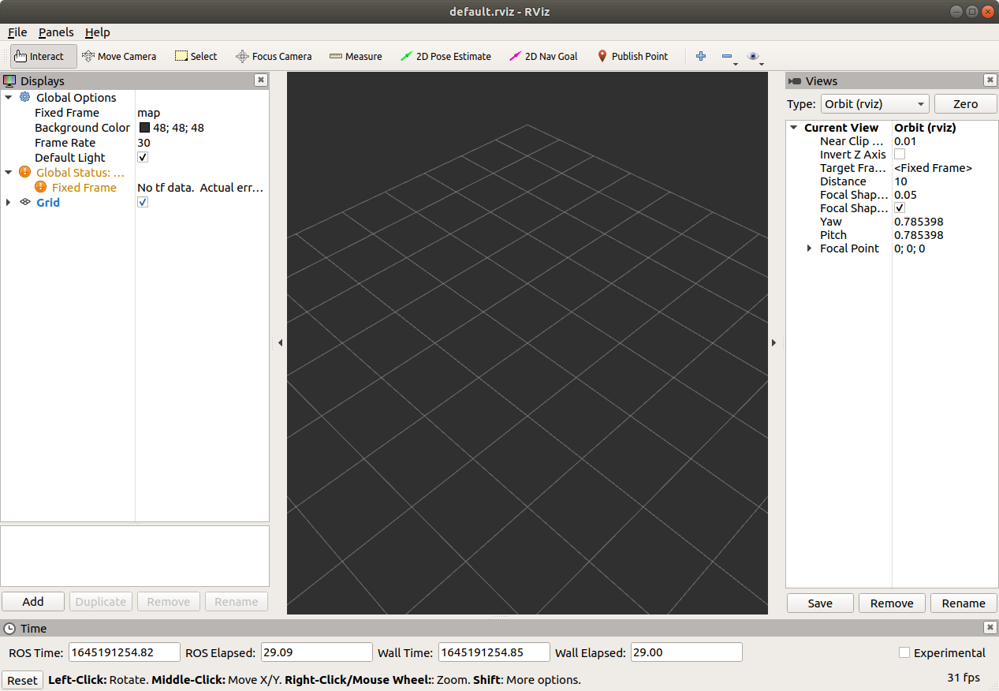
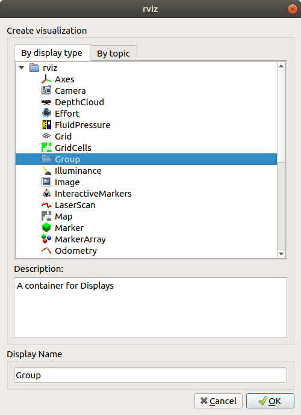

这篇文章将介绍如何在 ros melodic 中安装并启动 `rviz`, 并介绍 `rviz` 的基本使用方法.

# rviz 的安装和启动
在 ubuntu 系统下可以直接使用

```shell
sudo apt-get install ros-melodic-rviz
```

安装 rviz, 其中 `melodic` 可以替换为任意的 ros 发布版本.**在旧版的ros 发布版本 `fuerte` 中需要使用 `sudo apt-get install ros-fuerte-visualization` 进行安装**

安装完成 `rviz` 后, 为了运行 `rviz` 需要首先启动 `roscore`
```shell
souce /opt/ros/melodic/setup.bash # 加载环境变了
roscore& # 后台启动 roscore
```

然后通过 `rosrun` 来启动 `rviz` 节点
```shell
rosrun rviz rviz
```


# rviz 的用户界面介绍
节点启动后将会进入 `rviz` 的用户界面, 如上图所示.

## 菜单栏和工具栏
在用户界面的上方的菜单栏中, 通过 `File` 可以加载和保存 `rviz` 配置, `Panel` 菜单可以添加和删除面板. `Help` 菜单用于查看 `rviz` 的相关帮助页面. 

菜单栏的下方为一个工具栏面板,  工具栏中的相关工具的作用如下
* `Move Camera` - 移动摄像头, 快捷键为 **m**
* `Select` - 用于选择3D空间中的物品,  快捷键为 **s**. 在选择时按住 **Shift** 键可以添加物品, 选择按住 **Ctrl** 键将会删除物品. 在该工具下可以按下 **Alt** 键可以移动摄像头, 按下 f 键可以将摄像头聚焦到对应的物品上.
* `Focus Camera` -  将摄像头聚焦到鼠标的位置, 快捷键为 **f**
* `Measure` - 测量两点之间的距离
* `2D Nav Goal` - 发送一个 `goal` 主题的 ros 消息, 可以控制机器人的运动. 快捷键为 **g**
* `2D Pose Estimate` - 发送一个 `initialpose` 主题的消息, 用于设置机器人的初始位置., 快捷键为 **p**.

## 展示面板
`rviz` 用户界面的中间的黑色背景部分为 rviz 的 3D 图形预览窗口, 实际上是一个观察摄像头观察到的 rviz 3D 空间的内容图片. 

## 视图面板
`rviz` 用户界面的左侧为视图面板, 展示了所有已经加载的 3D 视图内容. 例如在上图中的 Grid 元素, 用于在 3D 图形空间中国添加2维坐标网格, 可以再展开的内容中对网格进行配置;全局选项视图(Global Options), 用于配置整个3维空间的属性; 如果需要添加其他视图内容, 可以点击视图面板下方的 `Add` 按钮, 按钮点击后会弹出一个选择框用于选择需要添加的视图内容, 如下图所示


此外也可以通过 `Duplicate` 和 `Remove` 以及 `Rename` 按钮对指定的视图内容进行拷贝和删除以及重命名.

## 观察面板  
在用户界面的右侧为观察面板, 用于配置和查看摄像头. 其中各种摄像头的类型含义如下
* `Orbital` - 这个类型的摄像头正对着一个锚点, 并可以围绕锚点转动, 锚点会在控制摄像头时以一个圆形碟子的方式显示. 可以通过按下鼠标左键并移动鼠标控制围绕锚点转动; 按下鼠标中键并移动鼠标可以上下左右移动锚点, 如果锚点上有物品, 对应物品将会跟鼠标一起运动. 滚动鼠标滚轮或者按下鼠标右键并移动鼠标可以控制摄像头和锚点之间的距离. 
* `FPS` - 第一人称视角, 摄像头会在固定的位置进行旋转. 按下鼠标左键将会选中一个物体, 并将摄像头对向它, 如果点击时移动鼠标可以控制摄像头的旋转; 如果按下鼠标中键并移动鼠标可以左右移动摄像头; 如果滚动鼠标滚轮或者按下鼠标右键并移动鼠标可以然后摄像头前进和后退.
* `Top-down Orthographic` - 上下正交投影视角, 摄像头总是从z轴往下看. 按下鼠标左键并移动鼠标可以让摄像头绕着z轴进行旋转; 按下鼠标中键并移动鼠标可以让摄像头在`X-Y`平面内移动; 通过鼠标滚轮或者按下鼠标右键并移动鼠标可以拉近和原理与`X-Y` 平面的距离.
* `XY Orbit` - 与 `Orbital` 一样, 只不过锚点将被限制在`X-Y`平面内.
* `Third Person Follower` - 与 `XY Orbitial`, 只不过锚点会被限制到目标框架内.

配置好摄像头后可以通过面板下方的`Save`按钮保存配置. 以后可以通过双击对应的配置切换摄像头配置. **摄像头配置将会保存到用户配置中, 而不会保存到配置文件中**

# tf 框架
`rviz` 通过 tf 转换系统来将相应框架中的坐标转换到全局框架中, 对于可视化来说, 有两个重要的框架:

1. 固定框架 - 固定框架必须固定在世界坐标系内. 它可以是一个地图框架或测距框架. 固定框架通常会被视为世界框架, 如果它被改变了, 所有目前展示的数据都会被清空.
2. 目标框架 - 即摄像头绑定的框架. 如果目标框架为地图, 那么摄像头的坐标是相对于地图的, 机器人将会相对摄像头进行移动; 如果目标框架为机器人上, 机器人移动时, 将会看到机器人仍在原地, 而其他东西在移动. 
