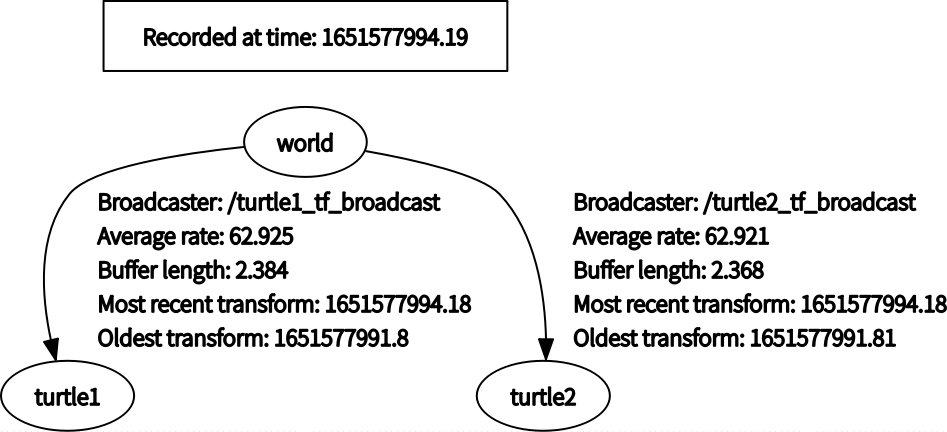

在这篇文章中，我们将会学习 `tf` 的基本概念，以及如何在c++中使用 `tf` ，文章主要参考 [tf21的官方文档](https://wiki.ros.org/tf2/Tutorials) 

# tf 的基本概念
tf 是用于跟踪ros系统中的各个坐标框架的工具。在ros系统中节点可以将坐标框架之间的坐标变换广播出去，而在其他节点（也可以是自身）可以监听坐标框架之间的变换，并缓存到 ros 系统中，然后在需要时可以获取到最新（或者指定时刻）的两个框架之间的坐标变换。

tf 最重要的两个概念就是框架和坐标变换，框架用于描述所有物体的状态，而坐标变换确保了不同框架下状态描述的一致性。

在一个系统中，我们都可以定义一个框架使该物体在该框架中保持不动，但为了统一的描述所有的物体，我们需要在这些框架中选择一个固定的框架，用于描述物体的绝对位置。

在 tf 中， 坐标框架是以树的结构来关联的，其中树的根节点代表固定框架，而其他子节点分别代表一个坐标框架， 树的边表示一个父子框架坐标变换。因此，在一个框架树中只能有一个固定框架，并且各个框架的关联关系中不能存在环的结构。

tf 除了通过框架树来保存框架直接的关联信息外，还会缓存下一段时间内（默认10s）的所有监测到的坐标变换，从而我们可以获取到指定时刻两个框架之间的坐标变换，或者在不同时刻的两个框架之间的坐标变换。

# 在 c++ 中使用 tf

下面我们将开始学习如何在 c++ 中使用 tf， 在此之前，我们首先需要在 catkin 工作空间下创建 `tf_tutorials` 包，如下所示
```shell
catkin_create_pkg tf_tutorials roscpp tf2_ros turtlesim
```

其中 `roscpp`, `tf2_ros`, `turtlesim` 为 `tf_tutorials` 所依赖的包。

首先，我们将编写一个 tf 框架坐标变换的广播者。

## 使用 tf 框架广播坐标变换

在 `tf_tutorials` 包的源目录下创建 *turtle_tf_broadcast.cpp* 文件， 并且将如下代码拷入到 *turtle_tf_broadcast.cpp* 文件中。

```cpp
#include <ros/ros.h>
#include <geometry_msgs/TransformStamped.h>
#include <tf2/LinearMath/Quaternion.h>
// tf2_ros 包提供的一种简化坐标变换广播功能的类 TransformBroadcaster
#include <tf2_ros/transform_broadcaster.h>
#include <turtlesim/Pose.h>
/**
 * @brief 获得乌龟的位置后，将二维位置作为tf消息广播
 */
void poseTransformCallback(std::string turtleName,
                           const turtlesim::PoseConstPtr pose) {
  static tf2_ros::TransformBroadcaster br;
  geometry_msgs::TransformStamped transformStampled;
  // 设置坐标变换的基本内容
  transformStampled.header.frame_id = "world";
  transformStampled.header.stamp = ros::Time::now();
  transformStampled.child_frame_id = turtleName;
  // 设置坐标的原点位置，因为是二维空间移动，将z坐标固定为常数
  transformStampled.transform.translation.x = pose->x;
  transformStampled.transform.translation.y = pose->y;
  transformStampled.transform.translation.z = 0;
  // 设置围绕z轴的旋转角度
  tf2::Quaternion rotation;
  rotation.setRPY(0, 0, pose->theta);
  transformStampled.transform.rotation.x = rotation.x();
  transformStampled.transform.rotation.y = rotation.y();
  transformStampled.transform.rotation.z = rotation.z();
  transformStampled.transform.rotation.w = rotation.w();
  // 广播对应框架的坐标变换消息
  br.sendTransform(transformStampled);
};
int main(int argc, char **argv) {
  ros::init(argc, argv, "turtle_broadcast");
  if (argc != 2) {
    ROS_ERROR("need turtle name as argument");
    return -1;
  }
  // 可以通过命令行参数获取想要绑定框架的　turtle 的名称
  std::string turtleName = argv[1];

  ros::NodeHandle node;
  // 订阅对应 turtle 的位置消息，在乌龟创建后，每隔一段时间会自动发送该消息
  ros::Subscriber sub = node.subscribe<turtlesim::Pose>(
      turtleName + "/pose", 10,
      boost::bind(&poseTransformCallback, turtleName, boost::placeholders::_1));
  // 进入 ros 的消息循环, 已处理订阅的消息
  ros::spin();
  return 0;
}
```
在上述代码中我们订阅了由 `turtlesim` 发布的位置变消息  `/turtleName/pose`， 然后将乌龟的位置转换为 tf 的坐标框架 `/turtleName`， 并通过`tf2_ros::TransformBroadcaster` 将 `/turtleName` 相对于固定框架 `/world` 的坐标变换广播到 ros 的消息系统中。

在 tf2 中 坐标变换是以 `geometry_msgs::TransformStamped` 的结构存储的， 其结构如下
```json
{
    "header": { // 消息头
        "frame_id":  "world",   // 父框架名称
        "stamp" : 1231231 // 坐标变换的时间戳
    },
    "child_frame_id": "turtleName", // 子框架名称
    "transform": {
        "translation": { // 坐标平移
            "x": 1,
            "y": 1, 
            "z": 1
        },
        "rotation": {  // 坐标旋转的四元数
            "x": 1,
            "y": 2,
            "z": 3,
            "w": 4,
        }
    }
}
```

然后，我们需要将 `turtle_tf_broadcast` 添加到 cmake 中
```cmake
add_executable(turtle_tf_broadcast src/turtle_tf_broadcast.cpp)
target_link_libraries(turtle_tf_broadcast
  ${catkin_LIBRARIES}
)
```
并进行编译
```shell
catkin_make
```

为了测试效果，我们需要在包下创建一个 *launch* 文件夹，并在文件加下添加 *start_demo.launch* 文件，其中内容如下所示

```xml
<launch>
    <!-- 创建 /turtle1 乌龟-->
    <node pkg="turtlesim" type="turtlesim_node" name="sim" />
    <!-- 控制turtle1 的运动 -->
    <node pkg="turtlesim" type="turtle_teleop_key" name="teleop" />

    <!-- Axes -->
    <param name="scale_linear" value="2" type="double" />
    <param name="scale_angular" value="2" type="double" />

    <node pkg="tf_tutorials" type="turtle_tf_broadcast" args="/turtle1" name="turtle1_tf_broadcast" />
</launch>
```
在上述的 launch 文件中， 我们创建了 `sim`、`teleop` 和 `turtle1_tf_broadcast` 三个节点，其中 `sim` 节点创建了一个乌龟，并可以通过 `teleop` 节点进行控制，然后 `turtle1_tf_broadcast` 节点会实时的获取乌龟的位置并转换为坐标变换 `/turtle1`。执行
```shell
roslaunch tf_tutorials start_demo.launch
```
启动节点，并通过
```shell
rosrun tf tf_echo /world /turtle1
```
显示 `/world` 框架到 `/turtle1` 框架的坐标变换。

## tf 监听坐标变换

在 `tf_tutorials` 包的源目录下创建 *turtle_tf_listener.cpp* 文件， 并且将如下代码拷入到 *turtle_tf_listener.cpp* 文件中。 

```cpp
#include <geometry_msgs/Twist.h>
#include <ros/ros.h>
#include <tf2_ros/transform_listener.h>
#include <turtlesim/Spawn.h>
int main(int argc, char *args[]) {
  ros::init(argc, args, "tf_listener");
  ros::NodeHandle node;

  // 等待 /spawn 服务添加到ros系统
  ros::service::waitForService("/spawn");
  // 创建客户端
  ros::ServiceClient add_turtle =
      node.serviceClient<turtlesim::Spawn>("/spawn");
  std::string targetTurtleName = "turtle1";
  std::string turtleName = "turtle2";
  turtlesim::Spawn turtle;
  turtle.request.x = 4;
  turtle.request.y = 2;
  turtle.request.theta = 0;
  turtle.request.name = "/" + turtleName;
  add_turtle.call(turtle);

  // 用于控制 /turtle2 的速度
  ros::Publisher turtle_vel = node.advertise<geometry_msgs::Twist>(
      turtle.request.name + "/cmd_vel", 10);

  // 创建坐标变换的缓存，并设置坐标变换缓存10s
  tf2::BufferCore tf_buffer(ros::Duration(10));
  // 用于监听 tf 框架坐标变换， 创建以后开始监听ros消息
  // 总线中的坐标变换消息
  tf2_ros::TransformListener listener(tf_buffer);
  // 一秒钟执行2次
  ros::Rate rate(100);
  while (ros::ok()) {
    std::string error;
    geometry_msgs::TransformStamped transformStamped;
    try {
      // 获得一个从 turtle1 框架到　turtle12 框架的　tf 变换
      transformStamped =
          tf_buffer.lookupTransform(turtleName, targetTurtleName, ros::Time(0));
    } catch (tf2::TransformException ex) {
      ROS_ERROR("lookupTransform failed, %s", ex.what());
      // 等待一秒后继续
      ros::Duration(1.0).sleep();
      continue;
    }
    geometry_msgs::Twist vel_msg;

    double x = transformStamped.transform.translation.x,
           y = transformStamped.transform.translation.y;
    // 设置 turtle2 朝向变化的角速度
    vel_msg.angular.z = 4.0 * atan2(y, x);
    // 设置运动的距离,
    // x方向表示乌龟的前方，y方向表示乌龟的左侧，z方向表示乌龟的上方
    vel_msg.linear.x = 0.5 * sqrt(pow(y, 2) + pow(x, 2));

    turtle_vel.publish(vel_msg);
    rate.sleep();
  }
  return 0;
}
```
在上述代码中，我们首先等待 `turtlesim_node` 节点的 `/spawn` 服务可用，并通过 `/spawn` 服务创建了名为 **/turtle2** 的乌龟。

```cpp
// 创建客户端
ros::ServiceClient add_turtle =
  node.serviceClient<turtlesim::Spawn>("/spawn");
std::string targetTurtleName = "turtle1";
std::string turtleName = "turtle2";
turtlesim::Spawn turtle;
turtle.request.x = 4;
turtle.request.y = 2;
turtle.request.theta = 0;
turtle.request.name = "/" + turtleName;
add_turtle.call(turtle);
```

tf 的 `BufferCore` 用于缓存 tf 的坐标变换，而 `TransformListener` 类则负责监听相应的 ros 坐标变换消息，并在坐标变换缓存到 `BufferCore` 中
```cpp
// 创建坐标变换的缓存，并设置坐标变换缓存10s
tf2::BufferCore tf_buffer(ros::Duration(10));
// 用于监听 tf 框架坐标变换， 创建以后开始监听ros消息
// 总线中的坐标变换消息
tf2_ros::TransformListener listener(tf_buffer);
```
最后在  ros 消息循环中， 通过查找`/turtle2` 到 `/turtle1` 的坐标变换
```cpp
transformStamped =
          tf_buffer.lookupTransform(turtleName, targetTurtleName, ros::Time(0));
```
并将坐标变换转换为乌龟的运动速度

```cpp
double x = transformStamped.transform.translation.x,
           y = transformStamped.transform.translation.y;
// 设置 turtle2 朝向变化的角速度
vel_msg.angular.z = 4.0 * atan2(y, x);
// 设置运动的距离, x方向表示乌龟的前方，y方向表示乌龟的左侧，z方向表示乌龟的上方
vel_msg.linear.x = 0.5 * sqrt(pow(y, 2) + pow(x, 2));

turtle_vel.publish(vel_msg);
```
并通过 `/turtle2/cmd_vel` 消息控制 `/turtle2` 乌龟的运动。

在对应的 `CMakeLists.txt` 文件中添加 
```cmake
add_executable(turtle_tf_listener src/turtle_tf_listener.cpp)
target_link_libraries(turtle_tf_listener
  ${catkin_LIBRARIES}
)
```
并通过
```cpp
catkin_make
```
进行编译。

然后在 `start_demo.launch` 文件的 `launch` 标签内内添加如下两个节点
```xml
<node pkg="tf_tutorials" type="turtle_tf_broadcast" args="/turtle2" name="turtle2_tf_broadcast" />

<!-- turtle_tf_listener 节点将会创建 /turtle2 的乌龟 -->
<node pkg="tf_tutorials" type="turtle_tf_listener" name="turtle_tf_listener" />
```
接着通过 
```shell
roslaunch tf_tutorials start_demo.launch
```
启动节点， 并在对应终端中按上下左右方向键移动 `/turtle1`, 可以发现 `/turtle2` 会一直想 `/turtle` 乌龟移动。


最后可以通过 
```shell
# 打开一个窗口，并显示 框架信息
rosrun rqt_tf_tree rqt_tf_tree
# 或者，将框架信息保存为 pdf
# rosrun tf view_frames  
```
查看 tf 的各个框架信息，如下所示


可以看到在上面的例子中共创建了 3个框架，并存在 `world` 到 `turtle1` 和 `turtle2` 的直接坐标变换，并可以看到各个坐标变换的发布率，缓存长度，以及最新的和最旧的坐标变换的时间戳。

持外，可以发现虽然不存在 `/turtle1` 和 `/turtle2` 的直接坐标变换信息， 但是通过 
```cpp
transformStamped =
          tf_buffer.lookupTransform(turtleName, targetTurtleName, ros::Time(0));
```
tf 会自动计算出对应的坐标变换。
