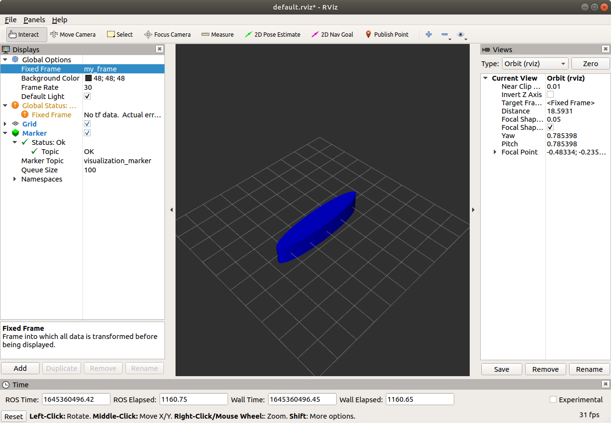
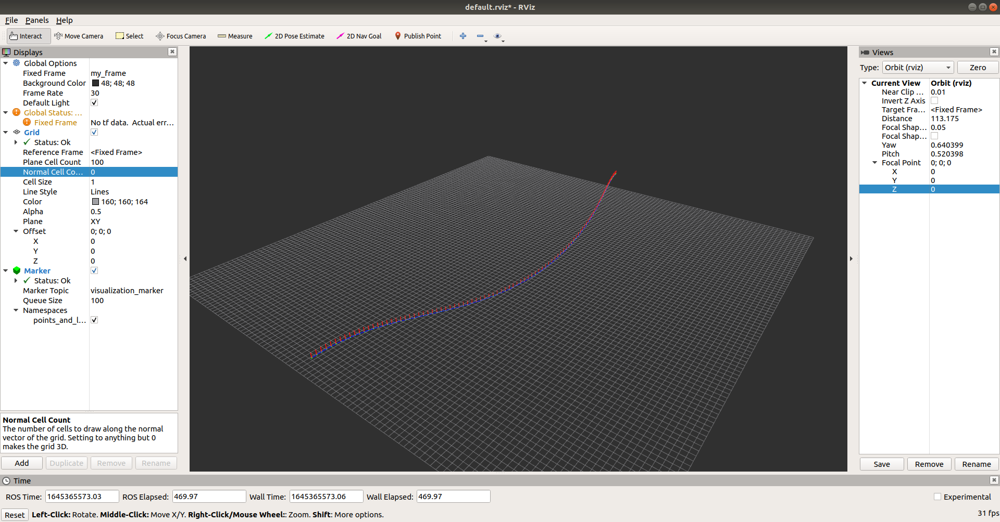
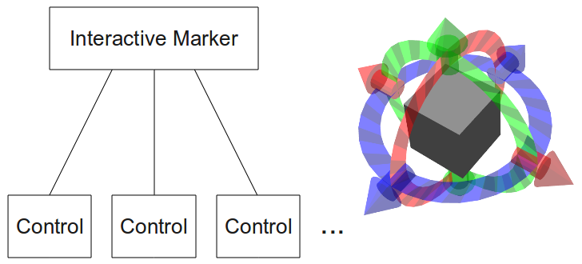
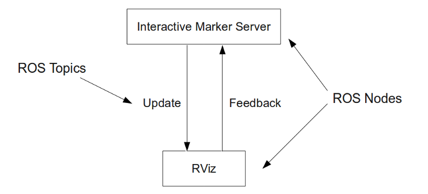
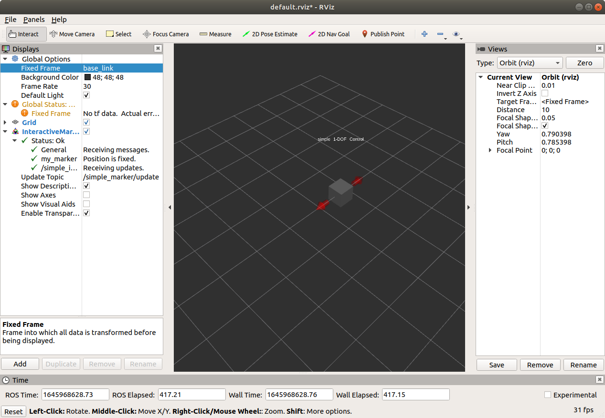

这篇文章主要介绍如何使用`rviz`, 并通过 c++ 代码创建 rviz 的标记(Marker, 包括基本图形, 点和线), 并与相应的 rviz 标记进行交互; 然后我们将学习如何创建 `rviz` 的插件, 集成`rviz`的组件到我们自己的应用以及对 3D Stereo 进行配置以对 `rviz` 进行渲染.


在开始学习前, 我们先要在 `catkin_ws` 工作空间下创建一个 `rviz_tutorials` 包, 下面的相关代码将在这个包内编译和执行.
```shell
# 进入 catkin_ws 空间的根目录
cd src
catkin_create_pkg rviz_tutorials roscpp visualization_msgs
# 退回 catkin_ws 空间的根目录
cd ..
```
#  `rviz` 基本图形创建

这一小节, 我们将会通过 c++ 代码想 rviz 传送图形, 图形是通过  `visualization_msgs::Marker` 主题的消息传送到 `rviz` 的. 

首先我们需要在  `rviz_tutorials` 的 `src` 目录下创建一个 `basic_shape.cpp` 文件, 并输入如下内容
```cpp
#include <ros/ros.h>
#include <visualization_msgs/Marker.h>

int main(int argc, char *argv[]) {
  ros::init(argc, argv, "basic_shape");
  ros::NodeHandle handle;
  // 一秒钟运行一次
  ros::Rate r(1);
  ros::Publisher marker_pub =
      handle.advertise<visualization_msgs::Marker>("visualization_marker", 1);
  visualization_msgs::Marker marker;
  // 设置标记的框架
  marker.header.frame_id = "/my_frame";
  // 设置标记的命名空间和 id, 如果多次发布同一个 命名空间和 id 的标记到 rviz,
  marker.ns = "basic_shape";
  marker.id = 0;
  // 将会覆盖掉之前发送的标记 设置标记的初始形状
  marker.type = visualization_msgs::Marker::CUBE;
  // action 表示操作, ADD 表示添加标记, DELETE 表示删除标记, DELETEALL
  // 表示删除所有标记, MODIFY 表示修改标记
  marker.action = visualization_msgs::Marker::ADD;
  // 设置标记的位置
  marker.pose.position.x = 0.0;
  marker.pose.position.y = 0.0;
  marker.pose.position.z = 0.0;
  // 设置标记的方向
  marker.pose.orientation.x = 0.0;
  marker.pose.orientation.y = 0.0;
  marker.pose.orientation.z = 0.0;
  marker.pose.orientation.w = 1.0;
  // 设置标记的颜色
  marker.color.r = 0.0f;
  marker.color.g = 0.0f;
  marker.color.b = 1.0f;
  marker.color.a = 1.0f;

  // 设置标记的大小
  marker.scale.x = 5.0;
  marker.scale.y = 1.0;
  marker.scale.z = 1.0;

  // lifetime 用于告诉 rviz 多长时间后自动删除该标记,  ros::Duration()
  // 表示永不删除
  marker.lifetime = ros::Duration();
  while (ros::ok()) {
    // 如果尚未有任何主题订阅在, 则进行等待
    while (marker_pub.getNumSubscribers() < 1) {
      if (!ros::ok()) {
        return 0;
      }
      ROS_WARN_ONCE("Please create a subscribe to the marker");
      sleep(1);
    }
    marker_pub.publish(marker);
    r.sleep();
    switch (marker.type) {
    case visualization_msgs::Marker::CUBE:
      marker.type = visualization_msgs::Marker::SPHERE;
      break;
    case visualization_msgs::Marker::SPHERE:
      marker.type = visualization_msgs::Marker::ARROW;
      break;
    case visualization_msgs::Marker::ARROW:
      marker.type = visualization_msgs::Marker::CYLINDER;
      break;
    case visualization_msgs::Marker::CYLINDER:
      marker.type = visualization_msgs::Marker::CUBE;
      break;
    }
  }
  return 0;
}
```
并在相应的包级别的 `CMakeLists.txt` 文件中添加如下代码
```cmake
add_executable(basic_shape_node src/basic_shape.cpp)
target_link_libraries(basic_shape_node
  ${catkin_LIBRARIES}
)
```
然后执行, 编译代码
```shell
#终端1 进入catkin_ws的根目录
catkin_make
```

下面我们将查看图形的效果, 首先打开 `rviz` 
```shell
# 终端 2
# 加载环境变量
. /opt/ros/melodic/setup.bash
# 启动 roscore
roscore&
# 启动 rviz
rosrun rviz rviz
```
然后在另外一个终端启动 `basic_shape_node` 节点
```shell
# 终端 1
# 加载环境变量
. ./devel/setup.bash
rosrun rviz_tutorials basic_shape_node
```
然后我们在 `rviz` 窗口中设置视图内容 `Global Options` 中的固定框架为 `/my_frame`, 然后添加一个视图内容 `Marker`, 如下图所示



完成上述步骤后, 我们可以在 `rviz` 的3D预览面板中看到一个图形, 并且每隔一秒图形会进行 *长方体* -> *椭球* -> *箭头* -> *椭圆柱体* -> *长方体* 的变换.

# `rviz` 中添加点和线

在这一小节中, 我们将会想 rviz 中添加点和线. 点和线也是通过 `visualization_msgs::Marker` 消息传送 `rivz` 中, 其中 `POINTS` 类型会添加一系列的点, `LINE_STRIP` 类型会将一系列的点连接处一条线, `LINE_LIST` 类型则会将每两个点连接成一系列的线.

在 `rviz_tutorials` 包的 `src` 目录下创建 `points_and_lines.cpp` 文件, 并输入如下内容
```cpp
#include <math.h>
#include <ros/ros.h>
#include <visualization_msgs/Marker.h>

int main(int argc, char *argv[]) {
  ros::init(argc, argv, "points_and_lines");
  ros::NodeHandle handle;
  ros::Publisher marker_pub =
      handle.advertise<visualization_msgs::Marker>("visualization_marker", 10);

  ros::Rate rate(30);
  visualization_msgs::Marker points, line_strip, line_list;
  points.header.frame_id = line_strip.header.frame_id =
      line_list.header.frame_id = "/my_frame";
  points.header.stamp = line_strip.header.stamp = line_list.header.stamp =
      ros::Time::now();
  points.action = line_strip.action = line_list.action =
      visualization_msgs::Marker::ADD;
  points.ns = line_strip.ns = line_list.ns = "points_and_lines";
  points.id = 0;
  line_strip.id = 1;
  line_list.id = 2;

  points.type = visualization_msgs::Marker::POINTS;
  line_strip.type = visualization_msgs::Marker::LINE_STRIP;
  line_list.type = visualization_msgs::Marker::LINE_LIST;

  points.pose.orientation.w = line_strip.pose.orientation.w =
      line_list.pose.orientation.w = 1.0;
  // 点通过 scale.x, scale.y 属性设置宽度和高度
  points.scale.x = 0.2;
  points.scale.y = 0.2;

  // 线和线段通过 scale.x 设置线宽
  line_strip.scale.x = 0.1;
  line_list.scale.x = 0.1;
  // 设置点为绿色
  points.color.g = 1.0f;
  points.color.a = 1.0f;

  // 设置线为蓝色
  line_strip.color.b = 1.0f;
  line_strip.color.a = 1.0f;

  // 设置线段为红色
  line_list.color.r = 1.0f;
  line_list.color.a = 1.0f;
  double start_angle = 0.0f;

  while (ros::ok()) {
    points.points.clear();
    line_strip.points.clear();
    line_list.points.clear();
    // 添加圆 x^2 + y^2 = 25 上的点
    for (int32_t i = 0; i < 100; ++i) {
      double a = start_angle + i / 100.0 * 2 * M_PI;
      geometry_msgs::Point p;
      p.x = i - 50;
      p.y = 5 * sin(a);
      p.z = 5 * cos(a);
      points.points.push_back(p);
      line_strip.points.push_back(p);
      line_list.points.push_back(p);
      p.z += 1.0;
      line_list.points.push_back(p);
    }
    marker_pub.publish(points);
    marker_pub.publish(line_strip);
    marker_pub.publish(line_list);
    rate.sleep();
    start_angle += 0.04;
  }
  return 0;
}
```

然后在包的 `CMakeLists.txt` 文件中添加
```cmake
add_executable(points_and_lines src/points_and_lines.cpp)
target_link_libraries(points_and_lines
  ${catkin_LIBRARIES}
)
```

最后执行 `catkin_make` 命令完成编译.

然后跟上一小节类似, 启动 `rviz` 和 `points_and_lines` 节点, 配置好固定框架并添加好 `Marker`视图内容后, 可以在 `rviz` 的图形预览面板中看到如下的内容


# rviz 交互服务器编写

rviz 中的图形可以通过交互服务器进行控制, 用户可以通过控制改变可交互的图形的位置与旋转, 也可以点击相应的图形进行选择或者弹出菜单. 这些可交互的图形通过`visualization_msgs/InteractiveMarker` 主题的消息传送到 rviz 中, 一个可交互的图形包括若干个基本图形(`visualization_msgs/Marker`), 一个右键菜单, 以及若干个控制器(`visualization_msgs/InteractiveMarkerControl`), 并且通过一个回调函数处理控制消息. 如下图所示


可交互图形需要在一个节点上创建一个 `InteractiveMarkerServer` 对象, 用于建立和 rviz 的连接, 这个连接用于将改变被传输到 rviz, 并将用户与图形的交互通知到该节点.


## 基本交互服务器的编写

在这一小节我们将实现一个简单的交互服务器.

首先创建一个 c++ 源文件 **simple_interactive_marker.cpp**, 并在文件中输入如下代码, 在代码中创建了一个基本的可交互图形, 并实现了图形的交互控制.

```cpp
#include <interactive_markers/interactive_marker_server.h>
#include <ros/ros.h>

/**
 * @brief  用户交互处理函数
 * @param feedback 交互的具体内容
 * 
 * 这个处理函数仅仅打印了图形的当前位置
 */
void processFeedback(
    const visualization_msgs::InteractiveMarkerFeedbackConstPtr &feedback) {
  geometry_msgs::Point position = feedback->pose.position;
  ROS_INFO_STREAM(feedback->marker_name << "is now at (" << position.x << ","
                                        << position.y << "," << position.z
                                        << ")");
}

int main(int argc, char *argv[]) {
  ros::init(argc, argv, "simple_interactive_marker");
  ros::NodeHandle handle;

  // 在命名空间 simple_marker 上创建一个交互服务器
  interactive_markers::InteractiveMarkerServer server("simple_marker");

  // 创建一个可交互的图形
  visualization_msgs::InteractiveMarker int_marker;

  // 设置图形的框架和时间戳
  int_marker.header.frame_id = "base_link";
  int_marker.header.stamp = ros::Time::now();

  // 设置图形的名称以及描述
  int_marker.name = "my_marker";
  int_marker.description = "simple 1-DOF Control";

  // 创建一个灰色的基本盒子
  visualization_msgs::Marker box_marker;
  box_marker.type = visualization_msgs::Marker::CUBE;
  box_marker.scale.x = 0.45;
  box_marker.scale.y = 0.45;
  box_marker.scale.z = 0.45;
  box_marker.color.r = 0.5;
  box_marker.color.g = 0.5;
  box_marker.color.b = 0.5;
  box_marker.color.a = 1.0;

  // 创建一个不可交互的控制器, 用于放置盒子
  visualization_msgs::InteractiveMarkerControl box_control;
  box_control.always_visible = true;
  box_control.markers.push_back(box_marker);

  // 创建一个控制器用于移动可交互的图形, 这个控制器中不包含任何基本图形, 这会让
  // rviz 生成一对箭头.
  visualization_msgs::InteractiveMarkerControl move_control;
  move_control.name = "move_x";
  move_control.interaction_mode =
      visualization_msgs::InteractiveMarkerControl::MOVE_AXIS;

  // 在可交互图形上添加各个控制器
  int_marker.controls.push_back(box_control);
  int_marker.controls.push_back(move_control);

  // 将可交互图形放到交互服务器中, 并告诉服务器在与该图形交互时调用
  // processFeedback
  server.insert(int_marker, &processFeedback);

  server.applyChanges();

  ros::spin();
  return 0;
}
```

然后修改 cmake 文件

```cmake
## 使用 visualization_msgs 和 interactive_markers 两个包
find_package(catkin REQUIRED COMPONENTS
  roscpp
  visualization_msgs
  interactive_markers
)
# 添加构建目标
add_executable(simple_interactive_marker src/simple_interactive_marker.cpp)
target_link_libraries(simple_interactive_marker
  ${catkin_LIBRARIES}
)
```

通过 `catkin_make` 完成目标的构建。 下面我们将在 rviz 中添加该图形。

首先启动 `roscore` 和 `rviz`

```shell
# 终端 2
# 加载环境变量
. /opt/ros/melodic/setup.bash
# 启动 roscore
roscore&
# 启动 rviz
rosrun rviz rviz
```

然后在启动 `simple_interactive_marker` 节点
```shell
# 终端 1
# 加载环境变量
. ./devel/setup.bash
rosrun rviz_tutorials simple_interactive_marker
```

最后在 rviz 中添加相应的可交互图形, 并按照下图所示进行配置


然后点击两个箭头就可对图形进行移动， 并在`simple_interactive_marker` 的命令行窗口中，可以看到图形的当前位置。