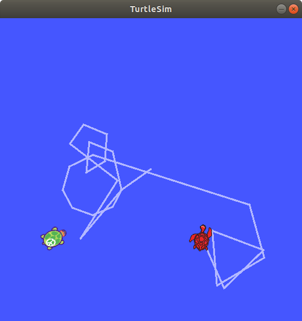

ros 服务是另一个ros节点之间进行通信的方式。一个ros 服务允许节点发送一个请求，并接收到请求的响应。

# ros 服务的调用
首先列出所有的ros服务如下所示
```shell
hybtalented@hybtaletented-163-com:~/study$ rosservice list
/clear
/kill
/reset
/rosout/get_loggers
/rosout/set_logger_level
/spawn
/teleop_turtle/get_loggers
/teleop_turtle/set_logger_level
/turtle1/set_pen
/turtle1/teleport_absolute
/turtle1/teleport_relative
/turtlesim/get_loggers
/turtlesim/set_logger_level
```
可以发现`turtle sim`节点提供了 `reset`、`clear`、`spawn`、`kill`、`turtle1/set_pen`、`turtle1/teleport_absolute`、`turtle1/teleport_relative`、`turtlesim/get_loggers`、 `turtlesim/set_logger_level` 共9个服务，此外`rosout`还提供了 `rosout/get_loggers` 和 `rosout/set_logger_level` 两个服务。

首先,通过 `rosservice type /spawn` 命令，我们可以查看到 `turtle sim`的`spawn`服务的类型为
```shell
turtlesim/Spawn
```
然后通过`rossrv show`查看服务的具体类型定义
```shell
hybtalented@hybtaletented-163-com:~/study$ rosservice type /spawn|rossrv show
float32 x
float32 y
float32 theta
string name
---
string name
```
可以看到在`---`前为服务的请求参数类型，`---`为服务响应类型。`spawn`服务然我们可以在指定位置x,y 处创建一个乌龟，乌龟的方向为 theta,名字为 name。

下面我们通过 `rosservice call` 调用`spawn`
```shell
hybtalented@hybtaletented-163-com:~/study$ rosservice call /spawn 2 3 0.5 "hello"
name: "hello"
```
可以看到roscall的输出打印乌龟的名字。服务调用完后 `turtlesim_node`的窗口内添加了一只乌龟，如图所示
