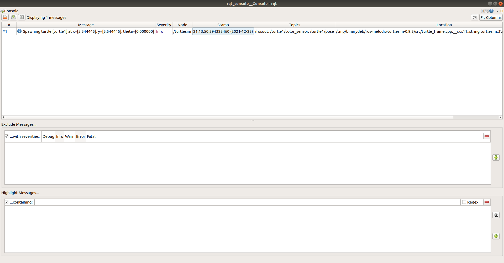
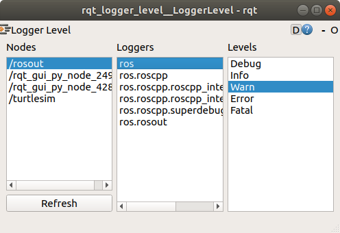
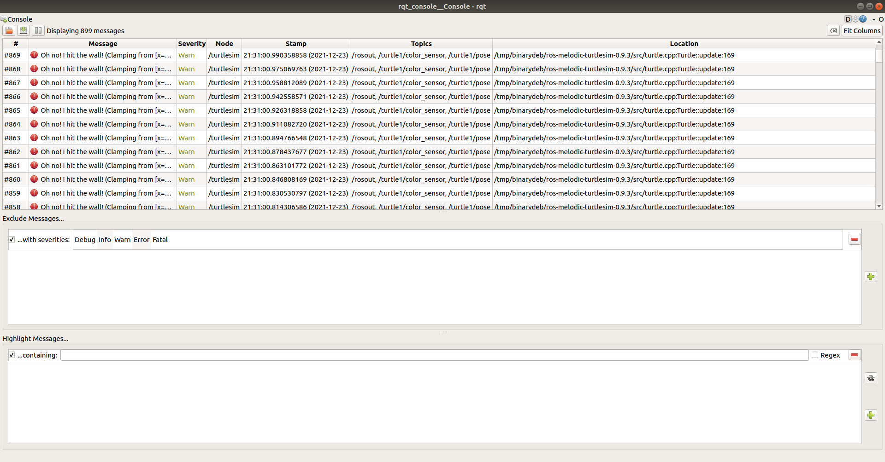
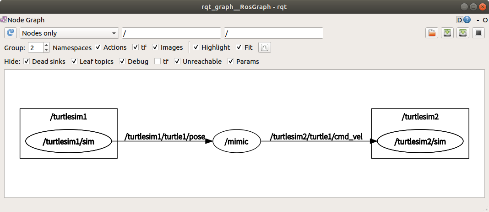

# ROS 节点（Node）的定义
ROS系统由以下几个部分组成
1. 节点（Nodes） - ROS节点是一个通过ROS与其他节点进行通信的可执行程序
2. 消息（Messages） - ROS消息是发布订阅主题所使用的结构化数据
3. 主题（Topics） - ROS节点可以发布一个消息到主题，或者订阅主题以接收消息
4. 主节点 （Master) - 主节点提供命名服务，ROS节点可以通过主节点找到其它ROS节点
5. rosout - rosout 为ROS用于的输出服务的节点，等价于 stdout/stderr
6. roscore - Master 服务、 rosout 服务以及 ros 参数服务


ROS节点就是一个通过ROS包编译出来的可执行程序，ROS节点可以通过ROS客户端库与其它节点进行通信。ROS阶段可以发布或订阅一个主题，也可以使用或者提供一个服务。

# ros节点的启动
## 启动 roscore 
在ROS启动前，首先要启动 roscore 服务，
```shell
roscore
```
如果服务正常启动，将会产生如下类似的消息
```
... logging to /home/hybtalented/.ros/log/af5e3a84-5a4a-11ec-b30a-e09467e33a05/roslaunch-hybtaletented-163-com-10904.log
Checking log directory for disk usage. This may take a while.
Press Ctrl-C to interrupt
Done checking log file disk usage. Usage is <1GB.

started roslaunch server http://hybtaletented-163-com:45577/
ros_comm version 1.14.12


SUMMARY
========

PARAMETERS
 * /rosdistro: melodic
 * /rosversion: 1.14.12

NODES

auto-starting new master
process[master]: started with pid [10929]
ROS_MASTER_URI=http://hybtaletented-163-com:11311/

setting /run_id to af5e3a84-5a4a-11ec-b30a-e09467e33a05
process[rosout-1]: started with pid
```

## ROS节点查看
首先，通过rosnode list 命令可以查看到当前正在运行的ros节点
```shell
hybtalented@hybtaletented-163-com:~$ rosnode list
/rosout
```
上诉输出表示，目前只有一个rosout节点正在运行。再次输入 rosnode info /rosout 可以查看rosout的节点信息如下

```
--------------------------------------------------------------------------------
Node [/rosout]
Publications: 
 * /rosout_agg [rosgraph_msgs/Log]

Subscriptions: 
 * /rosout [unknown type]

Services: 
 * /rosout/get_loggers
 * /rosout/set_logger_level


contacting node http://hybtaletented-163-com:41085/ ...
Pid: 10940
```
上述消息表示 rosout 节点 发布了主题 /rosout_agg 其中消息类型为 rosgraph_msgs/Log；订阅了主题 /rosout；提供了两个服务，分别为 /rosout/get_loggers 和  /rosout/set_logger_level；可以通过 http://hybtaletented-163-com:41085/ 与节点进行通信，其进程id为 10940。


## 启动 ROS 节点
通过 `rosrun` 命令可以启动ROS节点
```shell
rosrun turtlesim turtlesim_node
```
上述命令表示启动 `turtlesim` 包中的  `turtlesim_node`节点，运行命令后将会看到一个包含一个海龟的窗口。
这是，在另一个终端输入 `rosnode list` 可以查看到节点列表如下所示
```
/rosout
/turtlesim
```
`rosrun` 可以通过重映射参数改变节点的名称如下
```shell
rosrun turtlesim turtlesim_node __name:=my_turtle
```
再次执行 `rosnode list`  可以看到节点名称已经改变。

```
/my_turtle
/rosout
/turtlesim
```
可以发现/turtlesim 节点并没有消失，这是因为本文中是通过 `Ctrl+C`强制结束节点进程，而不是通过关闭窗口的方式，这时可以通过 `rosnode cleanup`可以清理掉已经退出的节点的信息。

```shell
hybtalented@hybtaletented-163-com:~$ rosnode cleanup
ERROR: connection refused to [http://hybtaletented-163-com:42405/]
Unable to contact the following nodes:
 * /turtlesim
Warning: these might include alive and functioning nodes, e.g. in unstable networks.
Cleanup will purge all information about these nodes from the master.
Please type y or n to continue:
y
Unregistering /turtlesim
done
hybtalented@hybtaletented-163-com:~$ rosnode list
/my_turtle
/rosout
```

# 节点调试相关功能
`rqt_console`可以查看节点的输出，执行
```shell
rosrun rqt_console rqt_console
```
节点将会弹出一个下图所示的界面


从中可以查看节点的输出，或者筛选查看的日志级别。

接着，启动 `rqt_logger_level` 节点来更改节点的日志级别
```shell
rosrun rqt_logger_level rqt_logger_level
```
如下图所示


修改日志级别为 `Warn`，然后发送修改`turtlesim_node`　速度的 ros　主题
```shell
rostopic pub /turtle1/cmd_vel geometry_msgs/Twist -r 1 -- '{ linear: {x: 2.0, y: 0.0, z: 0.0 }, angular: { x: 0.0, y: 0.0, z: 0.0 } }'
```
可以看到乌龟移动碰到墙壁时，会一直输出 `Warn` 日志


# 根据配置文件启动节点

ros 节点除了通过 `rosrun` 进行启动以外，还可以通过 launch 配置文件的方式进行启动。 

首先通过 `roscd` 命令进入在[ros 包的学习](./package.md)中创建的ros教程目录
```shell
hybtalented@hybtaletented-163-com:~/study$ roscd beginner_tutorials
roscd: No such package/stack 'beginner_tutorials'
```
如果出现上述报错，首先需要加载对应包的配置脚本

```shell
source ~/rpi-tools/ros_study/catkin_ws/devel/setup.sh
```

在进入 `beginner_tutorials` 包的目录后，创建并进入`launch`目录, 然后创建一个名为 `turtlemimic.launch` 的launch 文件，并在launch文件中输入以下的内容
```xml
<launch>
   <group ns="turtlesim1">
     <node pkg="turtlesim" name="sim" type="turtlesim_node"/>
   </group> 
   <group ns="turtlesim2">
     <node pkg="turtlesim" name="sim" type="turtlesim_node"/>
   </group>
   <node pkg="turtlesim" name="mimic" type="mimic">
     <remap from="input" to="turtlesim1/turtle1"/>
     <remap from="output" to="turtlesim2/turtle1"/>
   </node>
</launch>
```
launch 文件实际上是一个特殊的xml文件，文件以 根 `<launch>` 标签作为入口。在上述配置中，我们可以通过`<group>`标签将节点指定到对应的命名空间下，而不会造成两个节点的发布订阅的主题名和服务名冲突；通过 `<node>` 指定需要运行的节点；通过 `<remap>` 标签可以将节点中的发布和订阅的主题名称进行重新映射。

下面执行　`roslaunch`命令启动节点,　如下所示
```shell
hybtalented@hybtaletented-163-com:~/rpi-tools/ros_study/catkin_ws/src/beginner_turials/launch$ roslaunch beginner_tutorials turtlemimic.launch 
... logging to /home/hybtalented/.ros/log/d6b972f2-6331-11ec-ba38-e09467e33a05/roslaunch-hybtaletented-163-com-30508.log
Checking log directory for disk usage. This may take a while.
Press Ctrl-C to interrupt
Done checking log file disk usage. Usage is <1GB.

started roslaunch server http://hybtaletented-163-com:42179/

SUMMARY
========

PARAMETERS
 * /rosdistro: melodic
 * /rosversion: 1.14.12

NODES
  /
    mimic (turtlesim/mimic)
  /turtlesim1/
    sim (turtlesim/turtlesim_node)
  /turtlesim2/
    sim (turtlesim/turtlesim_node)

ROS_MASTER_URI=http://localhost:11311

process[turtlesim1/sim-1]: started with pid [30534]
process[turtlesim2/sim-2]: started with pid [30535]
process[mimic-3]: started with pid [30536]
```
然后在发布一个主题让　`turtlesim1/sim`　节点进行运动，
```shell
hybtalented@hybtaletented-163-com:~/study$ rostopic pub /turtlesim1/turtle1/cmd_vel geometry_msgs/Twist -r 1 -- '[2.0, 0.0, 0.0]' '[0.0, 0.0, -1.8]'
```
可以发现两个窗口中的乌龟会一起进行转圈。

通过　`rqt_graph` 工具可以更好的理解上述 `launch`　文件的含义
```shell
rqt_graph
```
如图所示


其中　`mimic` 原始的主题的发布和订阅情况如下所示
```
hybtalented@hybtaletented-163-com:~/study$ rosnode info /mimic
--------------------------------------------------------------------------------
Node [/mimic]
Publications: 
 * /rosout [rosgraph_msgs/Log]
 * /turtlesim2/turtle1/cmd_vel [geometry_msgs/Twist]

Subscriptions: 
 * /turtlesim1/turtle1/pose [turtlesim/Pose]

Services: 
 * /mimic/get_loggers
 * /mimic/set_logger_level


contacting node http://hybtaletented-163-com:43553/ ...
Pid: 30536
Connections:
 * topic: /rosout
    * to: /rosout
    * direction: outbound (33061 - 192.168.2.148:53738) [11]
    * transport: TCPROS
 * topic: /turtlesim2/turtle1/cmd_vel
    * to: /turtlesim2/sim
    * direction: outbound (33061 - 192.168.2.148:53760) [14]
    * transport: TCPROS
 * topic: /turtlesim1/turtle1/pose
    * to: /turtlesim1/sim (http://hybtaletented-163-com:39539/)
    * direction: inbound (50204 - hybtaletented-163-com:54371) [10]
    * transport: TCPROS
```

由此，我们可以得出结论，上述的　launch 文件实际上在 `turtlesim1` 和 `turtlesim2` 两个命名空间中个创建了一个名为 `sim` 的 `turtlesim_node` 节点，然后创建了一个 `mimic` 节点， 并将 `mimic` 的 `/input` 主题重新映射到`/turtlesim1/turtle1`, `mimic` 的 `/output` 主题重新映射到`/turtlesim2/turtle1`。`mimic`节点实现了　`turtlesim２/sim` 对　`turtlesim1/sim`　的运动进行模仿。
