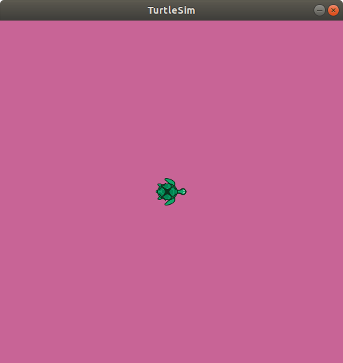

ros 参数（rosparam) 是一个参数服务器，允许节点存放和修改数据。参数服务器可以存储 整数、浮点数、布尔值、字典和列表，ros参数使用YAML标记语音作为语构。

# 获取和修改 ros 参数

首先列出当前正在使用的参数 
```shell
hybtalented@hybtaletented-163-com:~/study$ rosparam list
/rosdistro
/roslaunch/uris/host_hybtaletented_163_com__43175
/rosversion
/run_id
/turtlesim/background_b
/turtlesim/background_g
/turtlesim/background_r
```

即使 ros 节点已经退出或者整个ros系统奔溃，ros配置会一直保留，
通过`rosparam get` 命令可以读取参数的值
```shell
hybtalented@hybtaletented-163-com:~/study$ rosparam get /turtlesim/background_r
69
```
然后通过`rosparam set` 命令可以设置参数的值
```shell
rosparam set /turtlesim/background_r 200
rosparam set /turtlesim/background_g 100
rosparam set /turtlesim/background_b 150
```
`/turtlesim/background_r` 可以控制 `turtlesim_node` 的窗口的背景颜色，但是这时已经打开的窗口的背景色不会立即改变，需要通过调用`/clear`服务使配置生效
```shell
rosservice call /clear
```
现在 `turtlesim_node` 的窗口将会类似于下图所示



# ros 参数的保存和加载
使用`rosparam dump` 和 `rosparam load` 命令可以方便的将所有（或指定命名空间）的 ros 参数保存到文件中，例如
```shell
rosparam dump turtlesim_params.yaml turtlesim
```
这时，打开`turtlesim_params.yaml`后可以看到 `turtlesim`命名空间下的所有参数

```yaml
{background_b: 150, background_g: 100, background_r: 200}
```
如果在调用 `rosparam dump` 不设置命名空间，得到的 `full_params.yaml` 文件如下所示
```yaml
rosdistro: 'melodic

  '
roslaunch:
  uris: {host_hybtaletented_163_com__43175: 'http://hybtaletented-163-com:43175/'}
rosversion: '1.14.12

  '
run_id: d6b972f2-6331-11ec-ba38-e09467e33a05
turtlesim: {background_b: 150, background_g: 100, background_r: 200}
```

使用 `rosparam load` 命令可以将保存的`yaml`文件中的参数加载到ros参数服务器中，在调用`rosparam load` 时同样可以添加命名空间
```shell
rosparam load turtlesim_params.yaml myturtle
```
在次获取所有的ros参数如下所示
```shell
hybtalented@hybtaletented-163-com:~/study$ rosparam get /
myturtle: {background_b: 150, background_g: 100, background_r: 200}
rosdistro: 'melodic

  '
roslaunch:
  uris: {host_hybtaletented_163_com__43175: 'http://hybtaletented-163-com:43175/'}
rosversion: '1.14.12

  '
run_id: d6b972f2-6331-11ec-ba38-e09467e33a05
turtlesim: {background_b: 150, background_g: 100, background_r: 200}
```
可以发现新增的参数被附加到了 `myturtle` 命名空间下。