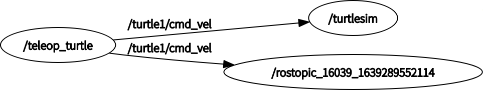
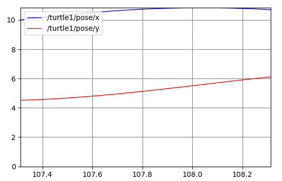

这篇文章主要对 ROS 主题(Topic) 的相关概念, 以及主题相关的 ros 工具进行介绍.

# 主题与节点的关系
首先确保 roscore 和 `turtlesim_node` 节点已经启动，运行
```shell
hybtalented@hybtaletented-163-com:~$ rosnode info turtlesim
--------------------------------------------------------------------------------
Node [/turtlesim]
Publications: 
 * /rosout [rosgraph_msgs/Log]
 * /turtle1/color_sensor [turtlesim/Color]
 * /turtle1/pose [turtlesim/Pose]

Subscriptions: 
 * /turtle1/cmd_vel [geometry_msgs/Twist]

Services: 
 * /clear
 * /kill
 * /reset
 * /spawn
 * /turtle1/set_pen
 * /turtle1/teleport_absolute
 * /turtle1/teleport_relative
 * /turtlesim/get_loggers
 * /turtlesim/set_logger_level


contacting node http://hybtaletented-163-com:41827/ ...
Pid: 3217
Connections:
 * topic: /rosout
    * to: /rosout
    * direction: outbound (54253 - 192.168.2.148:58270) [27]
    * transport: TCPROS
 * topic: /turtle1/cmd_vel
    * to: /teleop_turtle (http://hybtaletented-163-com:42853/)
    * direction: inbound (59072 - hybtaletented-163-com:60765) [26]
    * transport: TCPROS

```
可以发现 `turtlesim_node` 订阅了 `/turtle1/cmd_vel` 主题，这个主题的消息用于通知 turtlesim_node 节点启动的窗口内的乌龟进行移动。现在我们启动另外一个节点 `turtle_teleop_key`
```shell
rosrun turtlesim turtle_teleop_key
```
通过查看节点信息
```shell
rosnode info /teleop_turtle
--------------------------------------------------------------------------------
Node [/teleop_turtle]
Publications: 
 * /rosout [rosgraph_msgs/Log]
 * /turtle1/cmd_vel [geometry_msgs/Twist]

Subscriptions: None

Services: 
 * /teleop_turtle/get_loggers
 * /teleop_turtle/set_logger_level


contacting node http://hybtaletented-163-com:42853/ ...
Pid: 2635
Connections:
 * topic: /rosout
    * to: /rosout
    * direction: outbound (60765 - 192.168.2.148:58988) [11]
    * transport: TCPROS
 * topic: /turtle1/cmd_vel
    * to: /turtlesim
    * direction: outbound (60765 - 192.168.2.148:59072) [12]
    * transport: TCPROS

```
可以发现这个节点发布了 `/turtle1/cmd_vel` 主题的消息，`turtle_teleop_key` 节点的主要作用是通过键盘控制乌龟的速度。在启动 `turtle_teleop_key` 节点的终端内通过左右方向键可以控制乌龟的方向，通过前后方向键可以控制乌龟的前进和后退。

ROS 节点之间可以通过 发布和订阅主题的方式进行通讯，例如上述的例子中`/teleop_turtle` 发布了键盘按键主题（`/turtle1/cmd_vel`）而
`/turtlesim` 订阅了同一主题，实现了通过按键控制乌龟的移动。

下面我们将用 `rqt_graph` 命令查看所有当前运行的节点和主题。
首先安装 `rqt_graph` 包
```shell
sudo apt-get install ros-melodic-rqt
sudo apt-get install ros-melodic-rqt-common-plugins
```
然后启动`rqt_graph`节点
```shell
rosrun rqt_graph rqt_graph
```
可以得到如下所示的主题订阅图

可以发现 `/teleop_turtle` 和 `/turtlesim` 之间通过主题`/turtle1/cmd_vel` 进行通信。

# 查看主题的消息
通过 rostopic 命令可以查看ros主题的消息。运行 `rostopic echo /turtle1/cmd_vel` 命令，并在 `turtle_teleop_key` 节点所在终端内按下方向键，可以查看到类似如下所示的消息
```shell
rostopic echo /turtle1/cmd_vel
linear: 
  x: 0.0
  y: 0.0
  z: 0.0
angular: 
  x: 0.0
  y: 0.0
  z: -2.0
---
linear: 
  x: 2.0
  y: 0.0
  z: 0.0
angular: 
  x: 0.0
  y: 0.0
  z: 0.0
---
linear: 
  x: 0.0
  y: 0.0
  z: 0.0
angular: 
  x: 0.0
  y: 0.0
  z: 2.0
---
```
这是，我们再次查看 `rqt_graph` 可以看到


通过 `rostopic list -v` 命令可以查看到所有的ros消息，通过`rostopic type /turtle1/cmd_vel` 可以查看`/turtle1/cmd_vel`消息的类型，通过`rosmsg show geometry_msgs/Twist`命令可以查看指定消息类型的数据结构，如下所示
```shell
rostopic list -v

Published topics:
 * /turtle1/color_sensor [turtlesim/Color] 1 publisher
 * /turtle1/cmd_vel [geometry_msgs/Twist] 1 publisher
 * /rosout [rosgraph_msgs/Log] 3 publishers
 * /rosout_agg [rosgraph_msgs/Log] 1 publisher
 * /turtle1/pose [turtlesim/Pose] 1 publisher

Subscribed topics:
 * /turtle1/cmd_vel [geometry_msgs/Twist] 1 subscriber
 * /rosout [rosgraph_msgs/Log] 1 subscriber
 * /statistics [rosgraph_msgs/TopicStatistics] 1 subscriber

hybtalented@hybtaletented-163-com:~/study$ rostopic type /turtle1/cmd_vel
geometry_msgs/Twist
hybtalented@hybtaletented-163-com:~/study$ rosmsg show geometry_msgs/Twist
geometry_msgs/Vector3 linear
  float64 x
  float64 y
  float64 z
geometry_msgs/Vector3 angular
  float64 x
  float64 y
  float64 z
```

# 主题的发布
通过 `rostopic pub` 命令可以发布一个指定主题的消息
```shell
rostopic pub -1 /turtle1/cmd_vel geometry_msgs/Twist -- '[2.0, 0.0, 0.0]' '[0.0, 0.0, 1.8]'
```
**上述命令中，`-1`表示只发布一次消息就退出，`/turtle1/cmd_vel` 和 `geometry_msgs/Twist`分别表示发布的主题和类型，`--`表示后面的参数不包含选项（即后面的参数中的`-` 不会被解析为一个选项），`'[2.0, 0.0, 0.0]'` 和 `'[0.0, 0.0, 1.8]'` 为消息参数，遵守 [YAML 格式](https://wiki.ros.org/ROS/YAMLCommandLine)。**
上述命令将会发送一个线速度为 2.0 角速度为 1.8 的消息。

通过去掉`-1`选项，加上 `-r 1` 选项可以让乌龟不断的旋转。
```shell
rostopic pub /turtle1/cmd_vel geometry_msgs/Twist -r 1 -- '[2.0, 0.0, 0.0]' '[0.0, 0.0, 1.8]'
```
这时我们可以通过 `rostopic hz` 命令查看主题的发布速率（Hz）如下

```shell
hybtalented@hybtaletented-163-com:~/study$ rostopic hz /turtle1/cmd_vel
subscribed to [/turtle1/cmd_vel]
no new messages
average rate: 1.001
        min: 0.999s max: 0.999s std dev: 0.00000s window: 2
average rate: 1.000
        min: 0.999s max: 1.000s std dev: 0.00025s window: 3
average rate: 1.000
        min: 0.999s max: 1.000s std dev: 0.00029s window: 4
average rate: 1.000
        min: 0.999s max: 1.000s std dev: 0.00026s window: 5
average rate: 1.000
        min: 0.999s max: 1.000s std dev: 0.00024s window: 6
average rate: 1.000
        min: 0.999s max: 1.000s std dev: 0.00028s window: 7
```
# 消息作图

启动 `rqt_plot` 节点
```shell
rosrun rqt_plot rqt_plot
```

通过`rosnode info turtlesim`可以发现 `turtlesim_node` 节点发布了消息 `/turtle1/pose` 即乌龟的位置，其类型如下
```shell
hybtalented@hybtaletented-163-com:~/study$ rostopic type /turtle1/pose|rosmsg show
float32 x
float32 y
float32 theta
float32 linear_velocity
float32 angular_velocity
```
因此在`rqt_plot`节点启动的窗口中将 `/turtle1/pose/x` 和 `/turtle1/pose/y`添加到坐标中，可以获得如下所示的图


# rosbag 的使用

`rosbag` 可以对ros消息进行录制和播放.

## 录制 ros 消息记录文件

首先启动 `roscore` 以及 `turtlesim_node` 和 `turtle_teleop_key` 两个节点

终端1 启动 roscore
```shell
. /opt/ros/melodic/setup.bash
roscore
```

终端2 启动 `turtlesim_node` 节点
```shell
. /opt/ros/melodic/setup.bash
rosrun rosrun turtlesim turtlesim_node
```

终端3 启动 `turtle_teleop_key` 节点
```shell
. /opt/ros/melodic/setup.bash
rosrun rosrun turtlesim turtlesim_node
```

列出所有的ros消息主题如下

```shell
hybtalented@hybtaletented-163-com:~/study$ rostopic list -v

Published topics:
 * /turtle1/color_sensor [turtlesim/Color] 1 publisher
 * /turtle1/cmd_vel [geometry_msgs/Twist] 1 publisher
 * /rosout [rosgraph_msgs/Log] 2 publishers
 * /rosout_agg [rosgraph_msgs/Log] 1 publisher
 * /turtle1/pose [turtlesim/Pose] 1 publisher

Subscribed topics:
 * /turtle1/cmd_vel [geometry_msgs/Twist] 1 subscriber
 * /rosout [rosgraph_msgs/Log] 1 subscriber
```

只有通过上述命令列出的发布主题才会被 ros 记录到日志文件中,  `/turtle1/cmd_vel` 主题是  `turtle_teleop_key` 节点发布的消息, 该消息可以控制乌龟的运动, `/turtle1/color_sensor` 和 `/turtle1/pose` 主题是 `turtlesim_node` 节点发布的消息, 这两个消息分别用于通知乌龟的颜色和位置. 

现在, 我们将记录该 ros 系统中的所有消息. 首先, 我们创建一个文件夹用于存放消息记录文件

```shell
mkdir ~/bagfiles
cd ~/bagfiles
```

然后, 用 `rosbag record` 命令开始记录 ros消息
```shell
rosbag record -a
```
`-a` 参数表示记录所有的消息, 如果只需要记录特定主题的消息只需要在 `rosbag record` 命令


在 `turtle_teleop_key` 节点所在的终端通过方向键控制乌龟的移动, 最后在记录消息的终端内输入 **Ctrl+C** 停止消息的记录, 在 `~/bagfiles` 目录下将会生成一个 `.bag` 结尾的文件, 并且文件名称格式为 `年-月-日-时-分-秒`. 这个文件中包含了所有在 `rosbag record` 命令执行过程中发布各个主题哦的消息.

在这里, 我们可以通过 `rosbag info` 命令查看消息记录文件的详情
```shell
hybtalented@hybtaletented-163-com:~/bagfiles$ rosbag info 2022-01-19-21-20-41.bag 
path:        2022-01-19-21-20-41.bag
version:     2.0
duration:    24.3s
start:       Jan 19 2022 21:20:41.83 (1642598441.83)
end:         Jan 19 2022 21:21:06.08 (1642598466.08)
size:        226.1 KB
messages:    3095
compression: none [1/1 chunks]
types:       geometry_msgs/Twist [9f195f881246fdfa2798d1d3eebca84a]
             rosgraph_msgs/Log   [acffd30cd6b6de30f120938c17c593fb]
             turtlesim/Color     [353891e354491c51aabe32df673fb446]
             turtlesim/Pose      [863b248d5016ca62ea2e895ae5265cf9]
topics:      /rosout                    4 msgs    : rosgraph_msgs/Log   (2 connections)
             /turtle1/cmd_vel          83 msgs    : geometry_msgs/Twist
             /turtle1/color_sensor   1505 msgs    : turtlesim/Color    
             /turtle1/pose           1503 msgs    : turtlesim/Pose
```
包括记录消息的时长, 开始时间和结束时间, 记录消息数, 消息类型以及各个主题的发布消息数量.

如果只想要录制指定主题的ros消息, 可以在 `rosbag recode` 后面指定需要录制的主题列表即可

```shell
hybtalented@hybtaletented-163-com:~/bagfiles$ rosbag record -O subset /turtle1/cmd_vel /turtle1/pose
[ INFO] [1642830708.295599754]: Subscribing to /turtle1/cmd_vel
[ INFO] [1642830708.322068287]: Subscribing to /turtle1/pose
[ INFO] [1642830708.327983800]: Recording to 'subset.bag'.
```

在上述命令中, 我们通过 `-O subset` 指定了输出文件名为 `subset.bag`, 并指定了只录制 `/turtle1/cmd_vel` 和 `/turtle1/pose` 主题的消息. 

现在, 我们再次通过 `rosbag info` 命令确认 `subset.bag` 文件的内容, 如下所示

```shell
hybtalented@hybtaletented-163-com:~/bagfiles$ rosbag info subset.bag 
path:        subset.bag
version:     2.0
duration:    16.7s
start:       Jan 22 2022 13:51:48.56 (1642830708.56)
end:         Jan 22 2022 13:52:05.27 (1642830725.27)
size:        91.4 KB
messages:    1096
compression: none [1/1 chunks]
types:       geometry_msgs/Twist [9f195f881246fdfa2798d1d3eebca84a]
             turtlesim/Pose      [863b248d5016ca62ea2e895ae5265cf9]
topics:      /turtle1/cmd_vel     52 msgs    : geometry_msgs/Twist
             /turtle1/pose      1044 msgs    : turtlesim/Pose
```

## 播放 ros 消息记录文件

在这一小节, 我们将在上一小节的基础上, 播放录制好的 ros 消息, 即将 消息文件 中录制的消息发布到 ros 系统中.

首先, 我们先关闭 `turtle_teleop_key` 节点, 并重启 `turtlesim_node` 节点, 因为现在我们将会使用录制好的消息控制乌龟的移动. 然后通过 `rosbag play` 命令再次播放录制好的消息

```shell
hybtalented@hybtaletented-163-com:~/bagfiles$ rosbag play subset.bag
[ INFO] [1642831187.733840101]: Opening subset.bag

Waiting 0.2 seconds after advertising topics... done.

Hit space to toggle paused, or 's' to step.
 [RUNNING]  Bag Time: 1642830725.241188   Duration: 16.679454 / 16.711702                
Done.
```

可以看到乌龟将会自动开始移动, 然而, 我们看到的乌龟运动的轨迹可能会轻微偏移我们原先录制时的轨迹, 这是因为乌龟的运动对收到消息的时间比较敏感, 而 `rosbag` 无法完美的模拟录制时的消息发布时间, 就会导致乌龟运动的速度和方向发生改变. 

在 `rosbag play` 运行后默认会等待 0.2 秒才开始发布消息, 这个是为了让消息的订阅者知道对应主题的消息已经发布了, 并等待消息订阅者建立一条连接接受消息. 如果不做任何的等待, 消息订阅者可能无法收到一开始的部分消息. 我们可以在 `rosbag play` 时指定 `-d` 选项指定这个等待的时间. 此外, 我们还可以指定 `-s` 选项指定 `rosbag play` 播放时从录制文件的指定时间点开始播放, 而不是从头开始播放; 还可以通过 `-r` 选项控制消息的发布速率, 例如, 指定 `-r 2` 选项可以让消息以两倍的速率发布, 从而播放的时间也会缩短到原先的 1/2.

## 读取 ros 消息记录文件

首先, 我们需要准备好一个消息记录文件, 在这里我们将以 [https://open-source-webviz-ui.s3.amazonaws.com/demo.bag](https://open-source-webviz-ui.s3.amazonaws.com/demo.bag) 中的消息记录文件为例.

```shell
wget https://open-source-webviz-ui.s3.amazonaws.com/demo.bag
```


